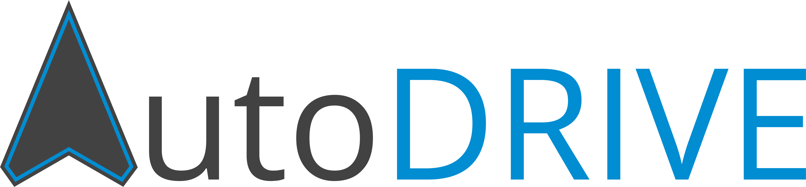
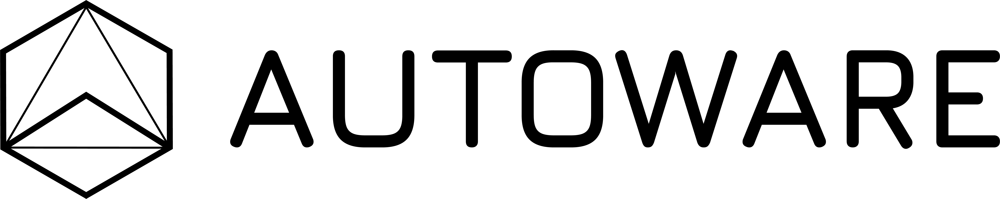

<p align="center">
 &nbsp;&nbsp;&nbsp;&nbsp;&nbsp; 
</p>


[](https://hub.docker.com/r/autodriveecosystem/autodrive_autoware/)
[](https://hub.docker.com/r/autodriveecosystem/autodrive_autoware/)

## Documentation

In order to set up the stack yourselves and run the demo examples, please refer to the [Installation Documentation](install.md).

## Docker Image

Docker images pertaining to [AutoDRIVE-Autoware Integration](https://github.com/Tinker-Twins/AutoDRIVE-Autoware) are available within the [AutoDRIVE-Autoware Repository](https://hub.docker.com/r/autodriveecosystem/autodrive_autoware) on [AutoDRIVE Ecosystem's Docker Hub](https://hub.docker.com/u/autodriveecosystem).

## YouTube Playlist

Deployment videos pertaining to [AutoDRIVE-Autoware Integration](https://github.com/Tinker-Twins/AutoDRIVE-Autoware) are available within the [Autoware Playlist](https://youtube.com/playlist?list=PL5Hd4DIMOmEJgpsPYCoLBGNb_91PZVxgA&si=UCN1iTwrKbx51Jry) on [AutoDRIVE Ecosystem's YouTube Channel](https://www.youtube.com/@AutoDRIVE-Ecosystem).

## Contributors

If you are curious to know more about the contributers or connect with them, please refer to the [Contributors Documentation](contributors.md).

## Citation

We encourage you to read and cite the following papers if you use any part of this repository for your research:

#### [Towards Validation of Autonomous Vehicles Across Scales using an Integrated Digital Twin Framework](https://arxiv.org/abs/2402.12670)
```bibtex
@inproceedings{AutoDRIVE-Autoware-2024,
author={Samak, Tanmay Vilas and Samak, Chinmay Vilas and Krovi, Venkat Narayan},
booktitle={2024 IEEE International Conference on Advanced Intelligent Mechatronics (AIM)}, 
title={Towards Validation of Autonomous Vehicles Across Scales using an Integrated Digital Twin Framework}, 
year={2024},
pages={1068-1075},
doi={10.1109/AIM55361.2024.10637205}
}
```
This work has been accepted at **2024 IEEE/ASME International Conference on Advanced Intelligent Mechatronics (AIM).** The publication can be found on [IEEE Xplore](https://doi.org/10.1109/AIM55361.2024.10637205).

#### [AutoDRIVE: A Comprehensive, Flexible and Integrated Digital Twin Ecosystem for Enhancing Autonomous Driving Research and Education](https://arxiv.org/abs/2212.05241)
```bibtex
@article{AutoDRIVE-Ecosystem-2023,
author = {Samak, Tanmay and Samak, Chinmay and Kandhasamy, Sivanathan and Krovi, Venkat and Xie, Ming},
title = {AutoDRIVE: A Comprehensive, Flexible and Integrated Digital Twin Ecosystem for Autonomous Driving Research &amp; Education},
journal = {Robotics},
volume = {12},
year = {2023},
number = {3},
article-number = {77},
url = {https://www.mdpi.com/2218-6581/12/3/77},
issn = {2218-6581},
doi = {10.3390/robotics12030077}
}
```
This work has been published in **MDPI Robotics.** The open-access publication can be found on [MDPI](https://doi.org/10.3390/robotics12030077).

#### [AutoDRIVE Simulator: A Simulator for Scaled Autonomous Vehicle Research and Education](https://arxiv.org/abs/2103.10030)
```bibtex
@inproceedings{AutoDRIVE-Simulator-2021,
author = {Samak, Tanmay Vilas and Samak, Chinmay Vilas and Xie, Ming},
title = {AutoDRIVE Simulator: A Simulator for Scaled Autonomous Vehicle Research and Education},
year = {2021},
isbn = {9781450390453},
publisher = {Association for Computing Machinery},
address = {New York, NY, USA},
url = {https://doi.org/10.1145/3483845.3483846},
doi = {10.1145/3483845.3483846},
booktitle = {2021 2nd International Conference on Control, Robotics and Intelligent System},
pages = {1–5},
numpages = {5},
location = {Qingdao, China},
series = {CCRIS'21}
}
```
This work has been published in **2021 International Conference on Control, Robotics and Intelligent System (CCRIS).** The publication can be found on [ACM Digital Library](https://dl.acm.org/doi/abs/10.1145/3483845.3483846).
